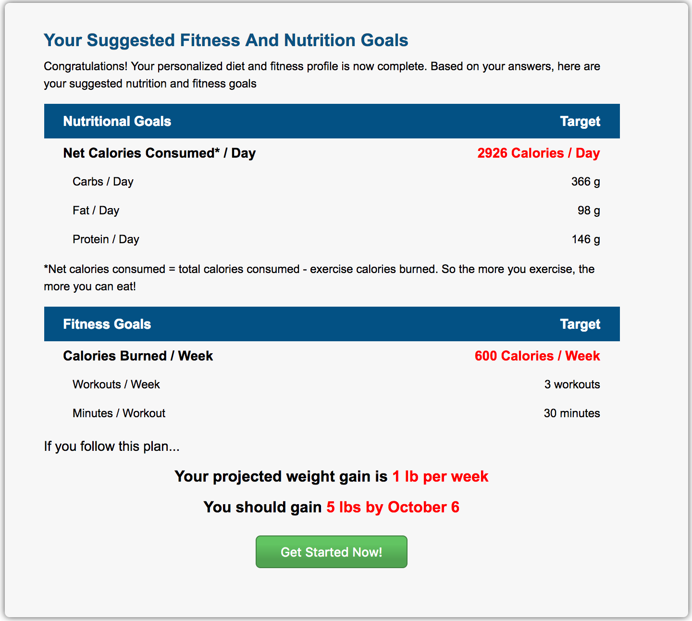
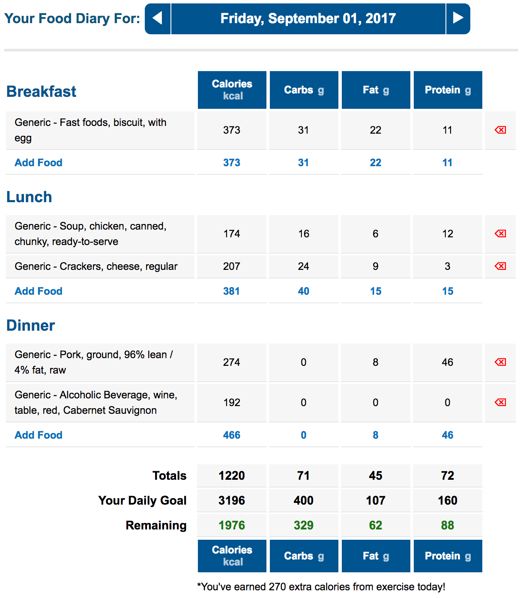

# KyleFitnessPal

[kyleFitnessPal live][heroku]

[heroku]: https://kylefitnesspal.herokuapp.com/#/

kyleFitnessPal is a full-stack calorie and exercise tracking web application inspired by myFitnessPal. It utilizes Ruby on Rails on the backend, a PostgreSQL database, and React with a Redux architectural framework on the frontend.

## Features & Implementation

### Goals

When signing up for the first time, a user also creates a goal, which includes the user's current and goal weight, activity level, and weight loss/gain goal (i.e. 'Lose 1 pound per week'). The goal information is stored in a separate goals table. Currently, a user can only create a goal on signup. However once additional goals are implemented, storing them in a separate table will allow users track their progression over time.

The user's goal information is used to calculate their total daily energy expenditure using the Harris-Benedict BMR equation. Based on the user's weight loss/gain goal, a daily recommended calorie amount is calculated and displayed after signup.

### Food Diaries

Food Diaries allow users to log food items eaten on a particular date for breakfast, lunch, and dinner. Information for food diaries is stored across three tables:

* FoodDiaries
  * columns: date, user_id
* Foods
  * columns: brand, name, calories, carbohydrates, protein, fats, serving_size
* FoodLoggings (join table)
  * columns: servings, meal, food_diary_id, food

The Food Diary React component structure consists of a DiaryHeader and a FoodDiaryIndex component.

The DiaryHeader shows the current date for the diary. Upon clicking the navigation arrows, an API call is made to the database to retrieve the diary for the next date or create a new diary if one does not exist for that date.

The FoodDiaryIndex component displays all the food loggings for the current diary based on meal type. The macronutrient info for all loggings is summed and compared with the user's daily recommended calorie amount.

## Further Directions for the Project

### Adding Goals

I plan to allow users to add new goals and see their weight loss progression over time.

### Saved Foods / Exercises

I plan to implement functionality which will save a user's commonly selected foods / exercises and display those at the top of the search page.
